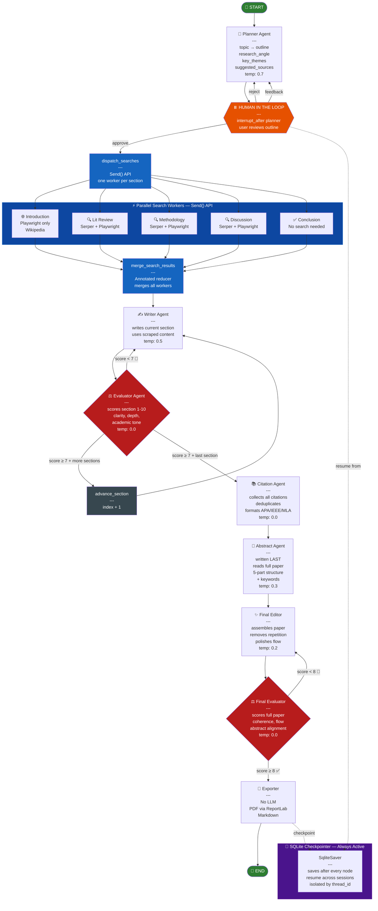

# 🎓 Scholar Lens

**Multi-Agent Research Paper Generator powered by LangGraph**

---

## ✦ Why We Built Scholar Lens

Scholar Lens was built for two reasons — one technical, one practical.

**Technically**, it was built to explore every major LangGraph feature in one cohesive system. Most LangGraph tutorials demonstrate one or two patterns in isolation. Scholar Lens deliberately combines all of them — `Send()` for parallel execution, `interrupt_after` for human-in-the-loop, `SqliteSaver` for cross-session checkpointing, `Annotated` reducers for merging parallel worker results, conditional edges for quality-gated retry loops, and `stream_mode="values"` for real-time UI streaming. Building a system that justifies every pattern is harder than it sounds — the domain has to be complex enough to need them all.

**Practically**, it was built to write its own paper. The first document Scholar Lens generated was a technical paper describing its own architecture — *"Quality-Gated Multi-Agent Pipelines for Automated Long-Form Content Generation: A LangGraph-Based Architecture with Parallel Retrieval and Evaluator Feedback Loops"* — submitted to arXiv. A system complex enough to describe itself is a system worth building.

The domain of research paper generation was chosen deliberately. Writing a good research paper is a multi-step, quality-sensitive, source-dependent task — it cannot be done well in a single LLM call. That constraint forces every architectural decision: why agents are specialized, why search runs in parallel, why writing is sequential, why the evaluator loop exists, and why the abstract is written last. The domain earns the architecture.

---

## ✦ Live Demo

> Enter any research topic → review the outline → approve → watch 8 specialized agents collaborate to produce a fully cited, PDF-ready research paper.

---

## 🏗️ Full Architecture

```
USER INPUT (topic + citation style)
            │
            ▼
    ┌───────────────┐
    │ Planner Agent │  LLM: GPT-4o-mini | temp: 0.7
    │               │  Generates research angle, section
    │               │  outline, key themes, search queries
    └───────┬───────┘
            │
            ⏸️  HUMAN-IN-THE-LOOP
            │   Graph pauses — user sees outline
            │   "approve" → resume
            │   "reject"  → replan from scratch
            │   feedback  → enrich topic, replan
            │
            ▼
    dispatch_searches()  ←── Send() API
    ┌──────────────────────────────────────────┐
    │           PARALLEL SEARCH WORKERS        │
    │                                          │
    │  Introduction  → Playwright (Wikipedia)  │
    │  Lit Review    → Serper + Playwright     │
    │  Methodology   → Serper + Playwright     │
    │  Discussion    → Serper + Playwright     │
    │  Conclusion    → No search               │
    │                                          │
    │  All run simultaneously via Send() API   │
    │  Results merged via Annotated reducer    │
    └──────────────────────────────────────────┘
            │
            ▼  (all workers complete)
    ┌───────────────┐
    │  Writer Agent │  LLM: GPT-4o-mini | temp: 0.5
    │               │  Writes one section at a time
    │               │  Uses scraped content as source
    │               │  Retry-aware (reads prev feedback)
    └───────┬───────┘
            │
            ▼
    ┌─────────────────┐
    │ Evaluator Agent │  LLM: GPT-4o-mini | temp: 0.0
    │                 │  Scores section 1-10 on:
    │                 │  clarity, depth, academic tone,
    │                 │  citation usage
    └────────┬────────┘
             │
             ├── score < 7.0 ──────────────────► Writer Agent (retry)
             │                                    (with feedback)
             │
             ├── score >= 7.0 + more sections ──► advance_section
             │                                    (index + 1)
             │                                    → Writer Agent
             │
             └── score >= 7.0 + last section ───► Citation Agent
                                                        │
                                                        ▼
                                               ┌────────────────┐
                                               │ Citation Agent │  LLM: GPT-4o-mini
                                               │                │  Collects raw citations
                                               │                │  from all sections
                                               │                │  Deduplicates + formats
                                               │                │  APA / IEEE / MLA
                                               └───────┬────────┘
                                                       │
                                                       ▼
                                               ┌────────────────┐
                                               │ Abstract Agent │  LLM: GPT-4o-mini
                                               │                │  Written LAST
                                               │                │  Reads full paper
                                               │                │  5-part structure
                                               │                │  + keywords
                                               └───────┬────────┘
                                                       │
                                                       ▼
                                               ┌────────────────┐
                                               │  Final Editor  │  LLM: GPT-4o-mini
                                               │                │  Assembles all parts
                                               │                │  Removes repetition
                                               │                │  Polishes flow
                                               │                │  Checks consistency
                                               └───────┬────────┘
                                                       │
                                                       ▼
                                               ┌──────────────────┐
                                               │ Final Evaluator  │  LLM: GPT-4o-mini
                                               │                  │  Scores full paper
                                               │                  │  on coherence, flow,
                                               │                  │  abstract alignment
                                               └────────┬─────────┘
                                                        │
                                                        ├── score < 8.0 ──► Final Editor (retry)
                                                        │
                                                        └── score >= 8.0 ─► Exporter
                                                                                │
                                                                                ▼
                                                                        ┌──────────────┐
                                                                        │   Exporter   │
                                                                        │  No LLM      │
                                                                        │  → PDF       │
                                                                        │  → Markdown  │
                                                                        └──────────────┘

━━━━━━━━━━━━━━━━━━━━━━━━━━━━━━━━━━━━━━━━━━━━━━━━━━
💾 SQLite Checkpointer runs throughout entire graph
   Saves state after every node — resume any session
━━━━━━━━━━━━━━━━━━━━━━━━━━━━━━━━━━━━━━━━━━━━━━━━━━
```

---

## 🤖 Agent Reference

| Agent | LLM | Temp | Role |
|---|---|---|---|
| Planner | GPT-4o-mini | 0.7 | Topic → outline + research angle |
| Search Worker | None | — | Serper + Playwright scraping (parallel) |
| Writer | GPT-4o-mini | 0.5 | Writes one section at a time |
| Evaluator | GPT-4o-mini | 0.0 | Scores sections 1-10, gates quality |
| Citation | GPT-4o-mini | 0.0 | Formats APA/IEEE/MLA citations |
| Abstract | GPT-4o-mini | 0.3 | Writes abstract last from full paper |
| Final Editor | GPT-4o-mini | 0.2 | Assembles + polishes complete paper |
| Final Evaluator | GPT-4o-mini | 0.0 | Scores full paper, gates export |
| Exporter | None | — | Generates PDF + Markdown |

---

## ⚙️ LangGraph Features Used

| Feature | Where |
|---|---|
| `StateGraph` + `TypedDict` | `graph.py` + `state.py` — shared state across all agents |
| `Annotated` reducer | `state.py` — `merge_search_results` merges parallel workers |
| `Send()` API | `graph.py` — parallel search worker dispatch |
| Conditional edges | Evaluator → writer/advance/citation routing |
| `interrupt_after` | After planner — human-in-the-loop outline approval |
| `graph.update_state()` | Reject/feedback → rewind to planner |
| `SqliteSaver` | Checkpoints after every node — resume across sessions |
| `stream_mode="values"` | Real-time streaming to Gradio UI |

---

## 🗂️ Project Structure

```
scholar_lens/
├── app.py                  # Gradio UI + graph orchestration
├── graph.py                # LangGraph nodes, edges, checkpointing
├── state.py                # ResearchState TypedDict + reducers
├── requirements.txt        # Python dependencies
├── Dockerfile              # HuggingFace Spaces deployment
└── agents/
    ├── planner.py          # Planner agent
    ├── search.py           # Parallel search worker (Serper + Playwright)
    ├── writer.py           # Section writer with retry logic
    ├── evaluator.py        # Section evaluator + final paper evaluator
    ├── citation.py         # Citation formatter
    ├── abstract_writer.py  # Abstract writer
    ├── final_editor.py     # Final editor + assembler
    └── exporter.py         # PDF + Markdown export
```

---

## 🔑 Environment Variables

Set these as **Secrets** in your HuggingFace Space settings:

| Variable | Required | Description |
|---|---|---|
| `OPENAI_API_KEY` | ✅ | GPT-4o-mini for all LLM agents |
| `SERPER_API_KEY` | ✅ | Google Search via Serper API |

---

## 🚀 Deploy to HuggingFace Spaces

1. Create a new Space → select **Docker** SDK
2. Upload all files maintaining the folder structure above
3. Add `OPENAI_API_KEY` and `SERPER_API_KEY` as Space secrets
4. Space builds automatically via `Dockerfile`
5. Playwright Chromium installs during build (~2 min first time)

---

## 💡 How to Use

```
1. Enter your research topic in the text box
   e.g. "Impact of Large Language Models on Software Engineering"

2. Choose citation style (default: APA)

3. Click "Begin Research"
   → Planner generates a structured outline

4. Review the outline in the chat
   → Type "approve" to start research
   → Type "reject" to generate a new outline
   → Type feedback to refine the outline

5. Watch agents work in real time
   → Search workers run in parallel
   → Writer + Evaluator loop per section
   → Citations formatted automatically
   → Abstract written last

6. Download your paper
   → PDF (formatted, academic layout)
   → Markdown (clean, portable)
```

---

## 🔬 Technical Design Decisions

**Why sequential writing, parallel searching?**
Search sections are fully independent — no section's search depends on another. Writing is sequential because each section conceptually builds on the previous one. Literature Review informs Methodology; Methodology informs Discussion.

**Why abstract last?**
Real researchers write abstracts last — after knowing what was actually written, not what was planned. The Final Evaluator checks abstract-paper alignment score, so writing it last improves quality measurably.

**Why different temperatures per agent?**
Planner needs creativity (0.7). Writers need balance (0.5). Evaluators and citation formatters need determinism (0.0). Matching temperature to task type improves output quality without changing models.

**Why SQLite checkpointing?**
HuggingFace Spaces can restart at any time. SQLite checkpointing means a user's paper generation survives restarts and can be resumed with the same thread_id.

---

## 🛠️ Built With

- [LangGraph](https://github.com/langchain-ai/langgraph) — Agent orchestration
- [LangChain](https://github.com/langchain-ai/langchain) — LLM abstractions
- [OpenAI GPT-4o-mini](https://openai.com) — Language model
- [Playwright](https://playwright.dev/python/) — Web scraping
- [Serper API](https://serper.dev) — Google Search
- [ReportLab](https://www.reportlab.com) — PDF generation
- [Gradio](https://gradio.app) — UI framework

---

*Part of the Lens suite — PR Lens · Story Lens · Scholar Lens*

---

## 📊 Mermaid Architecture Diagram

